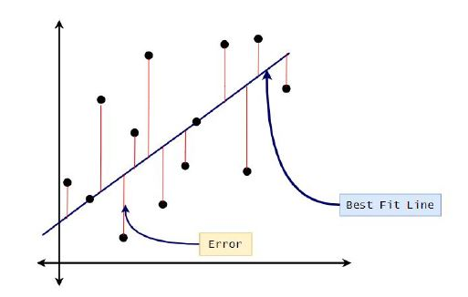

# PART-II: Linear Regression

## Prerequisite’s

### Python-Resources:
#### Blog/Articles:

- https://pythonbasics.org/
- https://medium.com/free-code-camp/learning-python-from-zero-to-hero-120ea540b567

#### Videos:
- https://www.youtube.com/watch?v=kqtD5dpn9C8

### Numpy Resources:
#### Blogs/Articles:
- https://medium.com/intellipaat/python-numpy-tutorial-b0118b79cf3c

#### Videos:
- https://www.youtube.com/watch?v=8JfDAm9y_7s

### Pandas Resources:
#### Blogs/Articles:
- https://towardsdatascience.com/in-depth-pandas-tutorial-5d896483ba8a

#### Videos:
- https://www.youtube.com/watch?v=UfmtEEXlP8E&feature=youtu.be

### Matplotlib Resources:
#### Blogs/Articles:
- https://medium.com/@kacawi/matplotlib-tutorial-python-plotting-6729f92b1bcb

#### Videos:
- https://www.youtube.com/watch?v=yZTBMMdPOww&feature=youtu.be

### What Is Regression?
***Regression*** analysis consists of a set of machine learning methods that allow us to predict
a continuous outcome variable (y) based on the value of one or multiple predictor variables
(x). Briefly, the goal of a regression model is to build a mathematical equation that defines y
as a function of the x variables. There are two types of regression, linear and logistics.

***Linear Regression*** is the oldest, simple, and widely used supervised machine learning algorithm for
predictive analysis.

### Regression Use Cases
- Prediction (E.g.: Predicting Real Estate Prices.)
- Forecasting (E.g.: Predicting demand for goods and services).

### Linear Regression Algorithm
&emsp;Let’s take a look at what goes under the hood and have a rough idea of what the
algorithm does before jumping into the code.

The ***Simple Linear Regression Model*** attempts to model the relation between two
variables by fitting a linear equation to observed data. One variable is considered to be an
independent variable while the other is considered to be a dependent variable

Here, talking about the graph, the equation of the line can generally, be taken as  
&emsp;y = m x + c  
where y is the dependent variable and x is the independent variable

m here is the slope of the line and c is intercept (here at the y axis),  

Linear Regression intends to find out the best values for m and c to fit the best possible line
in the graph, by finding the optimal values for m and c here. There are multiple ways of
finding the best fit line, a common one is using the least-squares method. Here the goal is to
fit a line in which vertical distance between the data points and the line is minimum.

###  Further concepts regarding the maths and intuition behind it would be explained in phase 3

